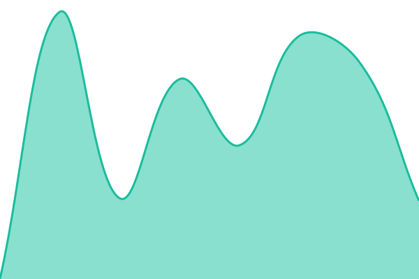
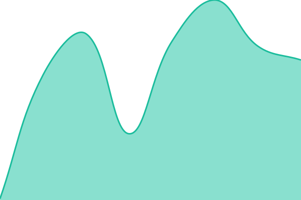
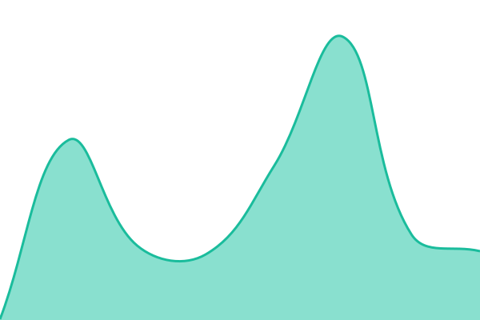
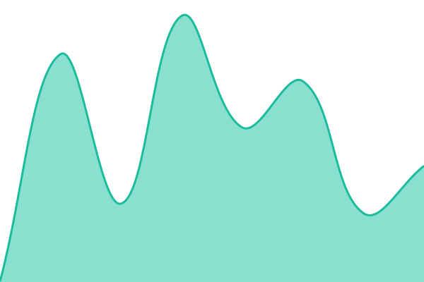

# [📈 Live Status](https://hovanhoa.github.io/upptime): <!--live status--> **🟩 All systems operational**

This repository contains the open-source uptime monitor and status page for [Hồ Văn Hòa](hovanhoa.net), powered by [Upptime](https://github.com/upptime/upptime).

With [Upptime](https://upptime.js.org), you can get your own unlimited and free uptime monitor and status page, powered entirely by a GitHub repository. We use [Issues](https://github.com/hovanhoa/upptime/issues) as incident reports, [Actions](https://github.com/hovanhoa/upptime/actions) as uptime monitors, and [Pages](https://hovanhoa.github.io/upptime) for the status page.

<!--start: status pages-->
<!-- This summary is generated by Upptime (https://github.com/upptime/upptime) -->
<!-- Do not edit this manually, your changes will be overwritten -->
<!-- prettier-ignore -->
| URL | Status | History | Response Time | Uptime |
| --- | ------ | ------- | ------------- | ------ |
|  [hovanhoa.net](https://hovanhoa.net) | 🟩 Up | [hovanhoa-net.yml](https://github.com/hovanhoa/upptime/commits/HEAD/history/hovanhoa-net.yml) | 

 422ms
     
 | 

<a href="https://hovanhoa.github.io/upptime/history/hovanhoa-net">100.00%</a>
    

|  [insight.hovanhoa.net](https://insight.hovanhoa.net) | 🟩 Up | [insight-hovanhoa-net.yml](https://github.com/hovanhoa/upptime/commits/HEAD/history/insight-hovanhoa-net.yml) | 

 215ms
     
 | 

<a href="https://hovanhoa.github.io/upptime/history/insight-hovanhoa-net">100.00%</a>
    

|  [gallery.hovanhoa.net](https://gallery.hovanhoa.net) | 🟩 Up | [gallery-hovanhoa-net.yml](https://github.com/hovanhoa/upptime/commits/HEAD/history/gallery-hovanhoa-net.yml) | 

 219ms
     
 | 

<a href="https://hovanhoa.github.io/upptime/history/gallery-hovanhoa-net">100.00%</a>
    

|  [chatbot.hovanhoa.net](https://chatbot.hovanhoa.net) | 🟩 Up | [chatbot-hovanhoa-net.yml](https://github.com/hovanhoa/upptime/commits/HEAD/history/chatbot-hovanhoa-net.yml) | 

 909ms
     
 | 

<a href="https://hovanhoa.github.io/upptime/history/chatbot-hovanhoa-net">100.00%</a>
    

|  [voicebot.hovanhoa.net](https://voicebot.hovanhoa.net) | 🟩 Up | [voicebot-hovanhoa-net.yml](https://github.com/hovanhoa/upptime/commits/HEAD/history/voicebot-hovanhoa-net.yml) | 

 301ms
     
 | 

<a href="https://hovanhoa.github.io/upptime/history/voicebot-hovanhoa-net">100.00%</a>
    

|  [landing page](https://hovanhoa.github.io) | 🟩 Up | [landing-page.yml](https://github.com/hovanhoa/upptime/commits/HEAD/history/landing-page.yml) | 

 138ms
     
 | 

<a href="https://hovanhoa.github.io/upptime/history/landing-page">100.00%</a>
    

|  [upptime](https://hovanhoa.github.io/upptime) | 🟩 Up | [upptime.yml](https://github.com/hovanhoa/upptime/commits/HEAD/history/upptime.yml) | 

 173ms
     
 | 

<a href="https://hovanhoa.github.io/upptime/history/upptime">100.00%</a>
    

|  [status.hovanhoa.net](https://status.hovanhoa.net) | 🟩 Up | [status-hovanhoa-net.yml](https://github.com/hovanhoa/upptime/commits/HEAD/history/status-hovanhoa-net.yml) | 

 313ms
     
 | 

<a href="https://hovanhoa.github.io/upptime/history/status-hovanhoa-net">100.00%</a>
    

<!--end: status pages-->

[**Visit our status website →**](https://hovanhoa.github.io/upptime)

## 📄 License

- Powered by: [Upptime](https://github.com/upptime/upptime)
- Code: [MIT](./LICENSE) © [Anand Chowdhary](https://anandchowdhary.com), supported by [Pabio](https://pabio.com)
- Data in the `./history` directory: [Open Database License](https://opendatacommons.org/licenses/odbl/1-0/)
